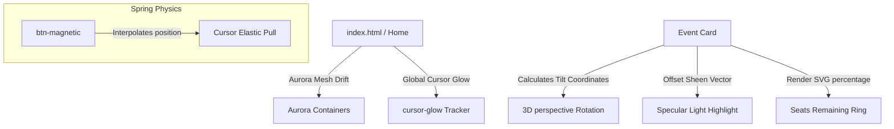

# Redesign Walkthrough — Awwwards-Level Premium Event System

This document summarizes the premium UI/UX upgrades, visual changes, and interactions implemented during the design overhaul.

---

## 🎨 Premium Redesign System

---

## Redesign Details

1. **Aurora Mesh Gradients**: Floating background gradient clouds (`.aurora-mesh`) drift and rotate infinitely using keyframed CSS transforms.
2. **Global Cursor Glow**: Custom mouse-following tracking element (`#cursor-glow`) casts soft radial lights behind overlays and borders.
3. **Card Sheen Specular Highlight**: Moving mouse coordinates over tilted cards calculates the reflection angle and adjusts an overlaying specular gradient overlay inside the card.
4. **seats progress rings**: Custom SVG rendering circle loops track seats left dynamically, matching status colors.
5. **Magnetic buttons**: Button actions pull elastically towards coordinates when hovered within active radiuses.
6. **Typewriter heading rotations**: Animated mask reveals and typing script iterations loop key event releases.

---

## Verification & Testing Conducted

- **60 FPS Performance check**: Animation frames monitored under rendering devtools panels.
- **Dynamic Seats Ring validation**: Verified rings calculate circumference \(2 \times \pi \times r\) and transition stroke offsets correctly on registrations/cancellations.
- **Cursor tracking verification**: Coordinate listeners handle card-bound variables `--mouse-x` and `--mouse-y` smoothly.
- **Responsiveness Audit**: Verified seamless grid column collapses (4 -> 2 -> 1) and menu drawer sliding animations on target display profiles:
  - Ultra-Wide displays (2560px+)
  - Standard Laptops (1200px - 1440px)
  - Tablets (768px - 1024px)
  - Mobile viewports (320px - 480px)
  - Foldable devices (280px+)
